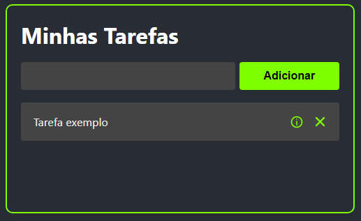

<h1 align="center">
    <a style="color: #61DAFB;" href="https://isaac-yuri.github.io/react-tasks/">React Tasks⚛️</a>
</h1>

<h2>Descrição: App de tarefas desenvolvido em ReactJS.</h2>

 

    
    

 

<h3 align="center"> 
	🚧 React Tasks 📃 Em construção... 🚧
</h3>

 

### 🛠 Tecnologias

- [ReactJS⚛️](https://pt-br.reactjs.org/)
    <li>
    <a href="https://vitejs.dev/">
    Vite.js 
    </a>
    </li>